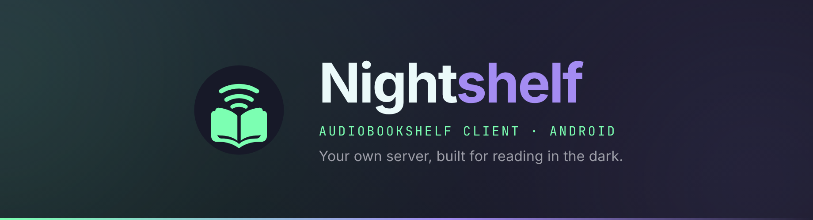
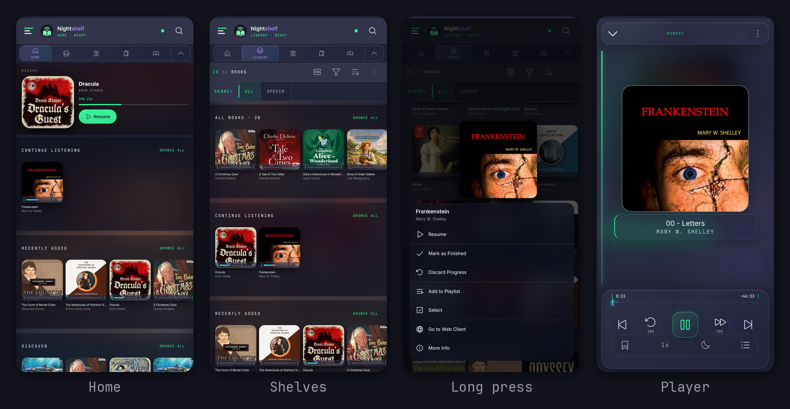
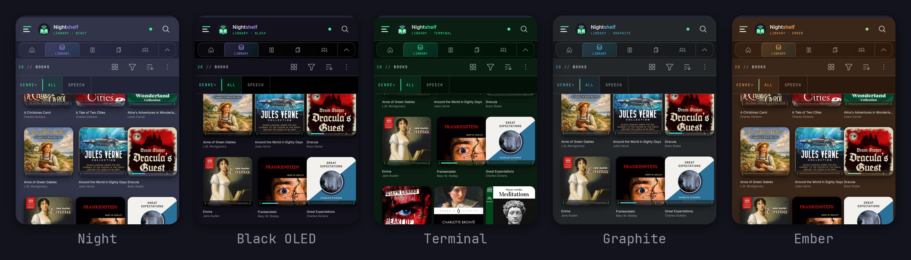

<div align="center">
  

  <p>
    
    
    <a href="LICENSE"></a>
    
    <a href="#install"></a>
  </p>

  <p>A fork of the <a href="https://github.com/advplyr/audiobookshelf-app">Audiobookshelf Android app</a>, rebuilt for phones used at night.</p>

  <p>Same server, same sync, same downloads. Denser shelves, five themes, and a long press that does something.</p>

  <p>
    <a href="https://github.com/Nomadcxx/Nightshelf/releases">Releases</a>
    ·
    <a href="https://github.com/Nomadcxx/Nightshelf/issues">Issues</a>
    ·
    <a href="https://www.audiobookshelf.org">Audiobookshelf</a>
  </p>
</div>

---

## Screenshots

<a href="docs/screens.png"></a>

## Themes

<a href="docs/themes.png"></a>

Same shelf, same scroll position. Black OLED is genuinely `#000000`, so the pixels are off rather than dark. Screenshots use a public-domain LibriVox library.

## Features

- **Resume hero**: whatever you are part-way through sits at the top of Home, with time remaining and one control
- **Shelf glass**: every rail sits on a blurred wash of its own leading cover, so the colour shifts as you scroll
- **Four covers per row**: rails came down from 205px to 104px, and the grid solves for columns against screen width
- **Long press**: hold a cover for 420ms and it lifts, with that item's actions underneath
- **Five themes**, switchable from Settings
- **Library switching**: pick a library from the drawer, or on first connect. Upstream renders the picker but never opens it
- **Motion control**: System, Full or Reduced, with Android's own reduced-motion request always winning
- **Semantic haptics**: six named intents, so meaning maps to intensity in one place rather than at each call site
- **Keyboard and TalkBack**: shelf cards take focus and answer to Enter or Space; the long-press panel traps focus and restores it on close
- **Android Auto**: four defects fixed, including one that truncated every library at 100 items

## Install

You need an Audiobookshelf server. NightShelf hosts nothing and sells nothing.

It installs alongside the official app rather than replacing it. Different package names, `com.nightshelf.app` and `com.audiobookshelf.app`, so you can keep both.

### F-Droid

<!-- Swap this for the live badge and listing link once the merge request at
     https://gitlab.com/fdroid/fdroiddata is merged:
     [](https://f-droid.org/packages/com.nightshelf.app) -->

> Not listed yet. The metadata F-Droid builds a listing from is in [`fastlane/`](fastlane/metadata/android/en-US), and the merge request is drafted in [`docs/fdroid/`](docs/fdroid/fdroid-request.md).

F-Droid builds every app from source on its own servers and refuses proprietary dependencies. NightShelf has none, so it qualifies. Upstream does not: it links Google's proprietary Cast framework, which is why you will find it on IzzyOnDroid under a non-free-components flag instead. [Removing Cast](docs/fdroid/fdroid-request.md#what-was-removed) is what separates the two.

### APK

Grab it from [Releases](https://github.com/Nomadcxx/Nightshelf/releases) and check it against `SHA256SUMS.txt`. Android will warn you about installing outside the Play Store, which is expected for a sideloaded build.

Releases are signed with a key held outside this repository, so an update always installs over the last one.

### Build from source

Requirements: Node 18+, JDK 21, Android SDK.

```bash
git clone https://github.com/Nomadcxx/Nightshelf.git
cd Nightshelf
npm ci

./node_modules/.bin/nuxt generate   # build the web layer
npx cap sync android                # copy it into the Android project

cd android && ./gradlew assembleDebug
```

The APK lands in `android/app/build/outputs/apk/debug/`.

> Two things that will cost you an afternoon. Run Nuxt through the local binary, because `npx nuxt` fetches Nuxt 4 and fails against this Nuxt 2 project. And Capacitor compiles against Java release 21, so JDK 17 stops with `invalid source release: 21`.

Tests run without a browser or a device:

```bash
node --test tests/*.test.js
```

Working on it? [CONTRIBUTING.md](CONTRIBUTING.md) has the traps that are not obvious from the code.

## Status

Beta, running daily against a 1,928-item library on a Pixel 8 Pro. Not there yet: iOS, and the Play Store.

## Licence

GPL-3.0, inherited from Audiobookshelf. Upstream copyright belongs to [advplyr and the Audiobookshelf contributors](https://github.com/advplyr/audiobookshelf-app/graphs/contributors); this fork modifies that work, keeps the licence and notices, and records every change in the commit history. Audiobookshelf neither endorses nor supports it.

Every dependency is under a free licence. Google Cast was the exception NightShelf inherited from upstream, and it is gone. The app carries no analytics, no crash reporting, no advertising, no account system and no self-update, and it talks to the server you point it at and nothing else.

You lose Chromecast, which is a real cost if you used it. Playback is otherwise unchanged, and Android Auto still works because it runs through `androidx.media`.
