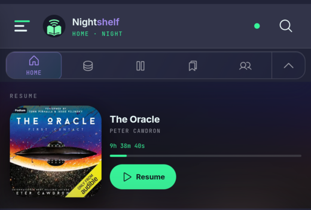
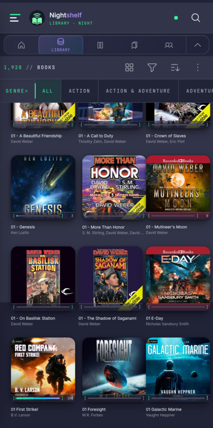
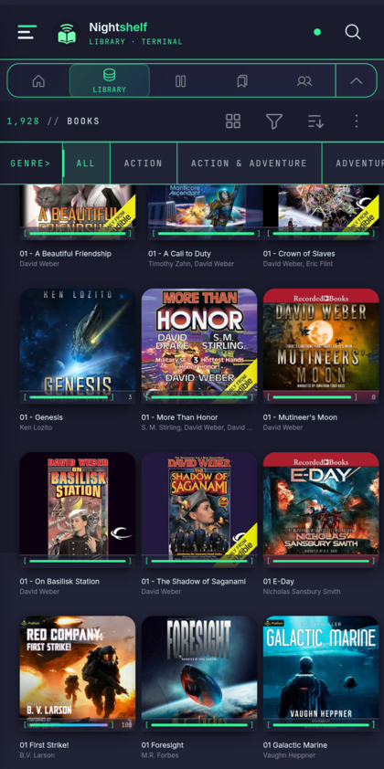
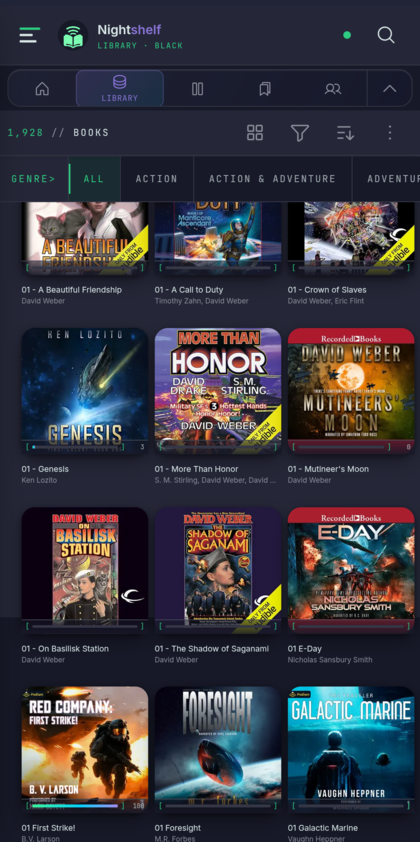
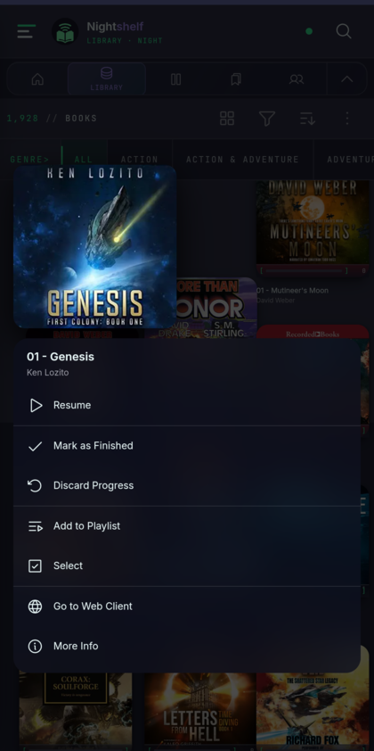
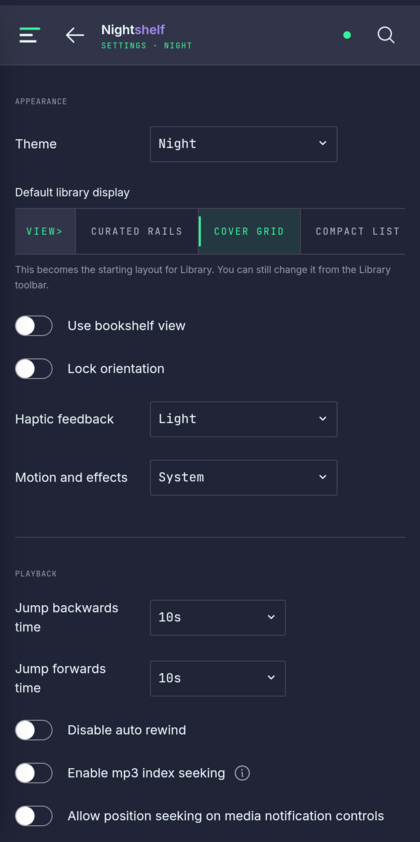

<p align="center">
  
</p>

<h1 align="center">NightShelf</h1>

<p align="center">
  An Android client for your own <a href="https://www.audiobookshelf.org">Audiobookshelf</a> server, built for reading in the dark.
</p>

<p align="center">
  
  
  
</p>

<p align="center">
  
</p>

---

## Three themes

The theme changes the whole surface rather than an accent colour. Same library, same scroll position, three themes.

| Night | Terminal | Black OLED |
|:--:|:--:|:--:|
|  |  |  |
| Navy ground, lilac accent | Phosphor green rules and progress | Deeper ground for OLED panels |

## Holding a cover

| Long press | Settings |
|:--:|:--:|
|  |  |

Hold a cover for 420&nbsp;ms and it lifts, with that item's actions underneath. The gesture cancels as soon as you move more than 10&nbsp;px, so a hold that turns into a scroll never fires. Books, podcasts, episodes, series, collections, playlists and search results all answer to it.

---

## What this is

NightShelf forks the [official Audiobookshelf Android app](https://github.com/advplyr/audiobookshelf-app). It talks to the same server, syncs the same progress, and downloads the same files. Playback, sync and the offline library come from upstream and behave the way you expect.

The fork changes how the app reads on a phone at night. Use upstream if you want the reference client. Try this one if the stock app feels too bright and too sparse against a few thousand books.

You supply the Audiobookshelf server. NightShelf hosts nothing and sells nothing.

## Requirements

- Android 7.0 (API 24) or newer
- An Audiobookshelf server you can reach
- Tested against a 1,928-item library on a Pixel 8 Pro

## Install

Take an APK from [Releases](https://github.com/Nomadcxx/Nightshelf/releases) and install it. Android warns you about installing outside the Play Store, which is expected for a sideloaded build.

NightShelf sits alongside the official app rather than replacing it. The two use different package names, `com.nightshelf.app` and `com.audiobookshelf.app`, so you can keep both and compare.

## Build from source

You need Node 18 or newer, a JDK, and the Android SDK.

```bash
git clone https://github.com/Nomadcxx/Nightshelf.git
cd Nightshelf
npm ci
```

The web layer builds first. Capacitor then copies it into the Android project:

```bash
./node_modules/.bin/nuxt generate
npx cap sync android
```

Then build the APK:

```bash
cd android
./gradlew assembleDebug
```

It lands at `android/app/build/outputs/apk/debug/app-debug.apk`.

Two things will cost you an afternoon if nobody says them out loud.

Run Nuxt through the local binary. `npx nuxt` fetches Nuxt 4 and fails against this Nuxt 2 project.

Capacitor compiles against Java release 21, so JDK 17 stops with `invalid source release: 21`. JDK 21 and JDK 25 both work:

```bash
JAVA_HOME=/usr/lib/jvm/java-25-openjdk ./gradlew assembleDebug
```

### Tests

```bash
node --test tests/*.test.js
```

136 tests cover the press-gesture state machine, the action model, panel geometry, view-state resolution and motion preference. No browser, no device.

### Debug icons override release icons

Android merges `android/app/src/debug/res/` over `android/app/src/main/res/`. A stale debug mipmap replaces the launcher icon without saying so, which is unpleasant to track down. After touching any identity asset:

```bash
./scripts/sync-debug-mipmaps.sh
```

### Release builds

Release signing is not configured here, and an unsigned release build will not install. Add a `signingConfigs` block to `android/app/build.gradle`, keep the keystore out of version control, and raise `versionCode` on anything you hand to someone else.

## Licence

GPL-3.0, inherited from Audiobookshelf. See [LICENSE](LICENSE).

Upstream copyright belongs to [advplyr and the Audiobookshelf contributors](https://github.com/advplyr/audiobookshelf-app/graphs/contributors). NightShelf modifies that work, keeps the licence and the copyright notices, and records every change in this repository's commit history. Redistribute NightShelf or anything built from it and your source goes out under GPL-3.0 as well.

Audiobookshelf neither endorses nor supports this fork. Raise anything you find here as an [issue on this repository](https://github.com/Nomadcxx/Nightshelf/issues).

## Project state

Beta. It runs daily against a 1,928-item library, syncs correctly, and the interaction work has been tested on hardware rather than in a browser.

Not done: iOS has had none of this work, downloads and local media still use the older card treatment, and there is no release signing configuration.
