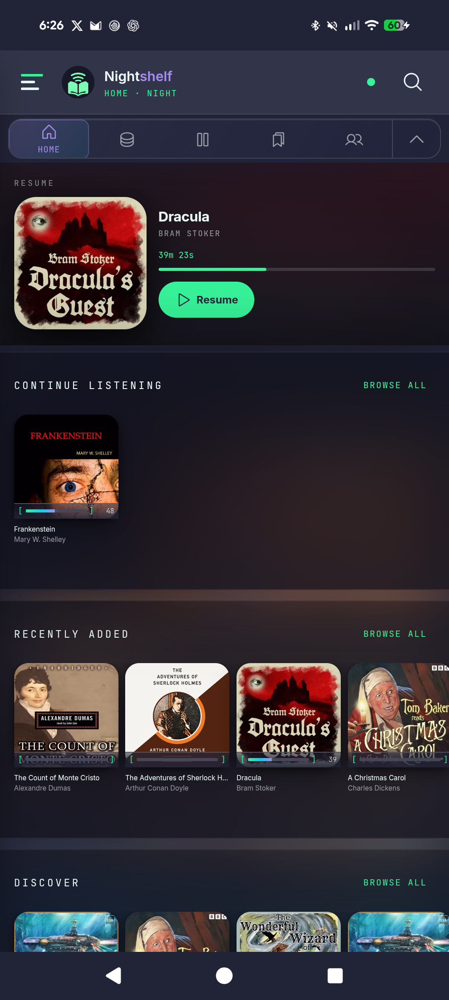
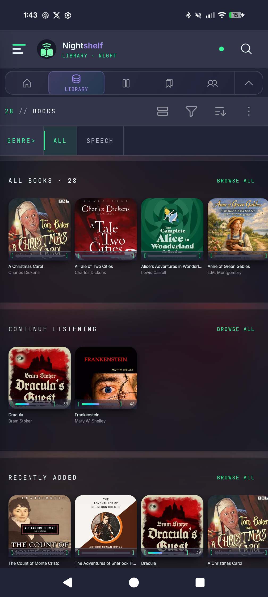
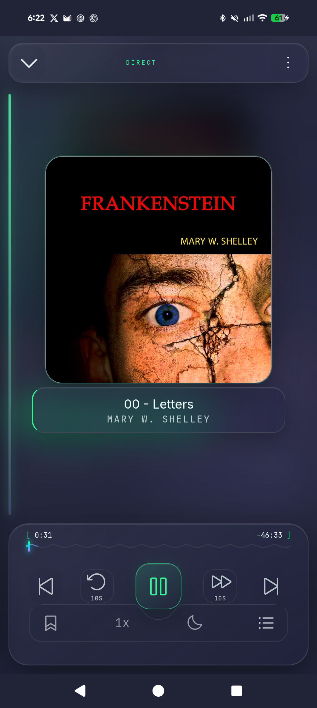
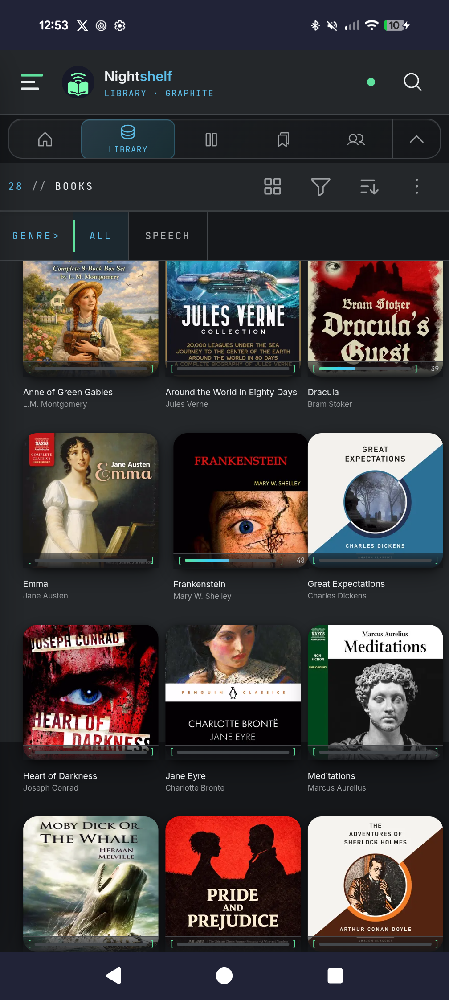
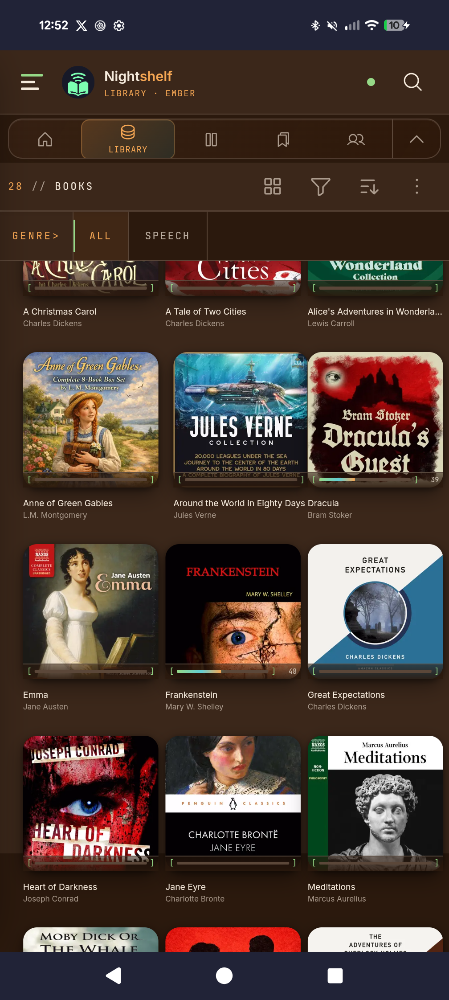

<div align="center">
  

  <p>
    
    
    
  </p>

  <p>A fork of the <a href="https://github.com/advplyr/audiobookshelf-app">Audiobookshelf Android app</a>, rebuilt for phones used at night.</p>

  <p>Same server, same sync, same downloads. Denser shelves, five themes, and a long press that does something.</p>

  <p>
    <a href="https://github.com/Nomadcxx/Nightshelf/releases">Releases</a>
    ·
    <a href="https://github.com/Nomadcxx/Nightshelf/issues">Issues</a>
    ·
    <a href="https://www.audiobookshelf.org">Audiobookshelf</a>
  </p>
</div>

---

## In use



Whatever you are part-way through sits at the top, with time remaining and one control.

<table>
<tr>
<td width="45%"></td>
<td>

**Shelf glass**

Every rail sits on a blurred wash of its own leading cover, so the colour under the glass shifts as you scroll. Four covers to a row — rails came down from 205px to 104px, and the grid solves for columns against screen width.

</td>
</tr>
</table>

<table>
<tr>
<td>

**Long press**

Hold a cover for 420ms. It lifts, and that item's actions appear underneath: resume, mark finished, discard progress, add to a playlist. No menu button, no navigation.

</td>
<td width="45%"></td>
</tr>
</table>

<table>
<tr>
<td width="45%"></td>
<td>

**The player**

Chapter, waveform progress, speed, sleep timer and the chapter list, without leaving the screen.

</td>
</tr>
</table>

## Five themes

Same shelf, same scroll position. One variable.

| Night | Black OLED | Terminal | Graphite | Ember |
|:--:|:--:|:--:|:--:|:--:|
|  |  |  |  |  |
| Navy, lilac | `#000000` | Phosphor CRT | Neutral, steel | Warm, low blue |

Black OLED is genuinely `#000000`, so the pixels are off rather than dark.

<sub>Screenshots use a public-domain LibriVox library, so nothing personal or commercial appears in them.</sub>

## What the pictures do not show

- **Motion control**: System, Full or Reduced, with Android's own reduced-motion request always winning
- **Semantic haptics**: six named intents, so the mapping from meaning to intensity lives in one place rather than at each call site
- **Keyboard and TalkBack**: shelf cards take focus and answer to Enter or Space; the long-press panel traps focus and restores it on close
- **Android Auto**: four defects fixed, including one that truncated every library at 100 items

## Installation

You need an Audiobookshelf server. NightShelf hosts nothing and sells nothing.

### Download

Grab the APK from [Releases](https://github.com/Nomadcxx/Nightshelf/releases). Android will warn you about installing outside the Play Store, which is expected for a sideloaded build.

It installs alongside the official app rather than replacing it. Different package names, `com.nightshelf.app` and `com.audiobookshelf.app`, so you can keep both.

### Build from source

Requirements: Node 18+, JDK 21, Android SDK.

```bash
git clone https://github.com/Nomadcxx/Nightshelf.git
cd Nightshelf
npm ci

./node_modules/.bin/nuxt generate   # build the web layer
npx cap sync android                # copy it into the Android project

cd android && ./gradlew assembleDebug
```

The APK lands in `android/app/build/outputs/apk/debug/`.

> Two things that will cost you an afternoon. Run Nuxt through the local binary, because `npx nuxt` fetches Nuxt 4 and fails against this Nuxt 2 project. And Capacitor compiles against Java release 21, so JDK 17 stops with `invalid source release: 21`.

Tests run without a browser or a device:

```bash
node --test tests/*.test.js
```

Touching any launcher or notification artwork means running `./scripts/sync-debug-mipmaps.sh` afterwards, because Android merges `src/debug/res/` over `src/main/res/` and a stale debug mipmap replaces the real icon silently.

## Status

Beta, running daily against a 1,928-item library on a Pixel 8 Pro. Not there yet: iOS, and any store listing.

## Licence

GPL-3.0, inherited from Audiobookshelf. Upstream copyright belongs to [advplyr and the Audiobookshelf contributors](https://github.com/advplyr/audiobookshelf-app/graphs/contributors); this fork modifies that work, keeps the licence and notices, and records every change in the commit history. Audiobookshelf neither endorses nor supports it.
